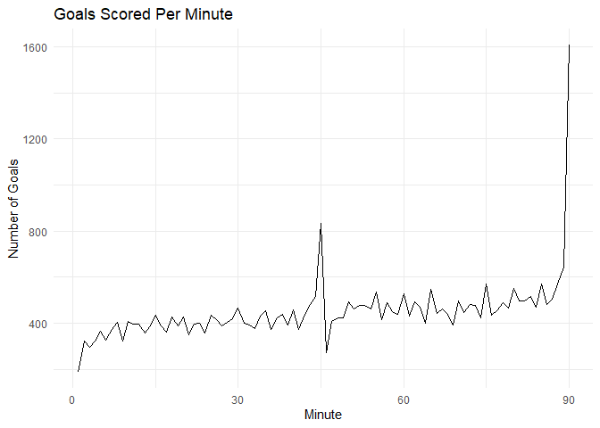
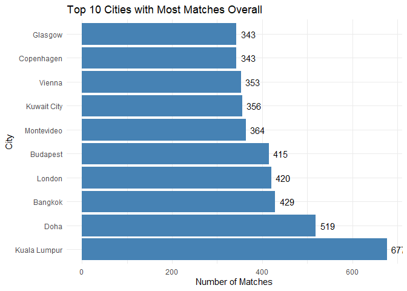

Soccer Data
================

## 1872-2022 International Soccer Game Results Analysis

I create three questions I am interested and try to figure out.

``` r
goalscorers <- read.csv("C:/Users/russe/Downloads/goalscorers.csv")
results <- read.csv("C:/Users/russe/Downloads/results.csv")
shootouts <- read.csv("C:/Users/russe/Downloads/shootouts.csv")
```

\#Question 1 Which minutes have most goals during a regular time of a
soccer game?

``` r
total_goals <- sum(results$home_score) + sum(results$away_score)
print(total_goals)
```

    ## [1] 131108

``` r
library(dplyr)
```

    ## 
    ## Attaching package: 'dplyr'

    ## The following objects are masked from 'package:stats':
    ## 
    ##     filter, lag

    ## The following objects are masked from 'package:base':
    ## 
    ##     intersect, setdiff, setequal, union

``` r
goal_summary <- goalscorers %>%
  filter(minute >= 0 & minute <= 90) %>%
  group_by(minute) %>%
  summarise(total_goals = n()) %>%
  arrange(-total_goals)
top_minute <- goal_summary[1, ]
print(top_minute)
```

    ## # A tibble: 1 × 2
    ##   minute total_goals
    ##    <int>       <int>
    ## 1     90        1606

``` r
goal_summary_least <- goalscorers %>%
  filter(minute >= 0 & minute <= 90) %>%
  group_by(minute) %>%
  summarise(total_goals = n()) %>%
  arrange(total_goals)
bottom_minute <- goal_summary_least[1, ]
print(bottom_minute)
```

    ## # A tibble: 1 × 2
    ##   minute total_goals
    ##    <int>       <int>
    ## 1      1         189

``` r
library(ggplot2)
game_goal <- ggplot(goal_summary, aes(x=minute, y=total_goals)) +
  geom_line() +
  labs(title="Goals Scored Per Minute",
       x="Minute",
       y="Number of Goals") +
  theme_minimal()
game_goal + scale_x_continuous(breaks = c(0, 30, 60, 90))
```

<!-- --> After run these code, I
found in soccer matches, the most goals are scored in the 90th minute,
the last minute of the game! There are many last-minute winners! And
also, I found the least minutes happens on first minutes. And I graph a
line graph to show the frequency of goals per minutes.

# Question 2

Which country has the most dominance over another country, and which two
countries are the friendliest?

    ## # A tibble: 1 × 4
    ##   home_team away_team results  count
    ##   <chr>     <chr>     <chr>    <int>
    ## 1 Argentina Uruguay   Home Win    62

    ## # A tibble: 1 × 4
    ##   home_team away_team results count
    ##   <chr>     <chr>     <chr>   <int>
    ## 1 Kenya     Uganda    Draw       24

    ## # A tibble: 1 × 4
    ##   home_team        away_team results  count
    ##   <chr>            <chr>     <chr>    <int>
    ## 1 Northern Ireland England   Away Win    35

Question 2, I want to figure out during 150 years, which country win
another country most times, I called it ‘most dominance country’ and
which two countries have draw most times, I called them ‘most friendly
countries’. After I use the r code to check, I found Argentina win
Uruguay 62 times during 150 years, and Kenya and Uganda draw 24 times,
they are so friendly. After I did these work, I want to which country
have win most on away to a home country to made the home field silence.
And the interesting things I found that England have won 35 times away
from Northern Ireland. And these two countries both belong to United
Kingdom, but they are not friends, they have many conflicts in history.

# Question 3

Which city host most international games?

``` r
library(dplyr)
library(leaflet)
library(maps)
library(ggplot2)

world_cities <- as.data.frame(maps::world.cities)
unique_cities <- data.frame(city = unique(results$city))
city_coords <- semi_join(world_cities, unique_cities, by = c("name" = "city"))
city_summary <- results %>%
  group_by(city, country) %>%
  summarise(count = n(), .groups = "drop")
city_summary <- left_join(city_summary, city_coords, by = c("city" = "name", "country" = "country.etc"))
na_rows <- which(is.na(city_summary$lat) | is.na(city_summary$long))
if (length(na_rows) > 0) {
  print(city_summary[na_rows, ])
}
```

    ## # A tibble: 1,094 × 7
    ##    city                country    count   pop   lat  long capital
    ##    <chr>               <chr>      <int> <int> <dbl> <dbl>   <int>
    ##  1 6th of October City Egypt          5    NA    NA    NA      NA
    ##  2 Aarhus              Denmark       15    NA    NA    NA      NA
    ##  3 Aberdare            Wales          1    NA    NA    NA      NA
    ##  4 Aberdeen            Scotland      15    NA    NA    NA      NA
    ##  5 Accra               Gold Coast     6    NA    NA    NA      NA
    ##  6 Adama               Ethiopia       3    NA    NA    NA      NA
    ##  7 Addis Ababa         Ethiopia     237    NA    NA    NA      NA
    ##  8 Addu City           Maldives       6    NA    NA    NA      NA
    ##  9 Aden                Yemen DPR      2    NA    NA    NA      NA
    ## 10 Agilat              Libya          1    NA    NA    NA      NA
    ## # ℹ 1,084 more rows

``` r
# m <- leaflet(city_summary) %>%
#   addTiles() %>%
#   addCircleMarkers(
#     ~long, ~lat, 
#     radius = ~count/100,  
#     color = "#1E90FF",  
#     fillColor = "#1E90FF",
#     fillOpacity = 0.5,  
#     weight = 1,  
#     opacity = 1,  
#     label = ~paste(city, ":", count, "games"),
#     popup = ~paste(city, ":", count, "games")
#   )
# 
# m

city_summary <- results %>%
  group_by(city) %>%
  summarise(count = n(), .groups = "drop")

top_cities_all <- city_summary %>%
  arrange(-count) %>%
  head(10) 

ggplot(top_cities_all, aes(x = reorder(city, -count), y = count)) +
  geom_col(fill = "steelblue") +
  geom_text(aes(label = count), position = position_dodge(width = 0.9), hjust = -0.3) +
  coord_flip() +
  labs(title = "Top 10 Cities with Most Matches Overall",
       x = "City",
       y = "Number of Matches") +
  theme_minimal()
```

<!-- -->

In the Final Question, I want to find which city host most international
games, which I will call this city as ‘Favorite soccer city’. First, I
try to use world map and use circle size to show. However, I found there
so many cities have host international games, and I cannot found which
city is the top. So I use bar graph to instead. And the result surprised
me. Because from my idea, I think this city must be European city.
However, the first cities to host international games are all Asian
cities.
